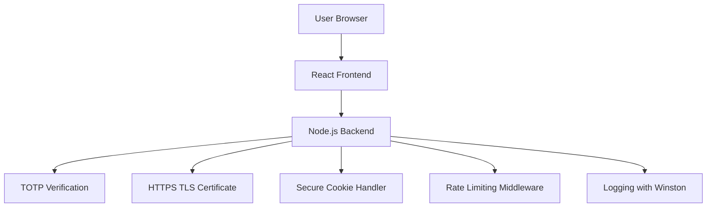

# Secure Web App Model

This is a secure full-stack web application built using Node.js and React.

The app implements modern security practices including:

- HTTPS/TLS encryption using OpenSSL certificates
- Two-factor authentication (2FA) with TOTP
- Security headers (CSP, HSTS, etc.)
- Rate limiting and input sanitization
- Logging and basic monitoring setup

## 🚀 Getting Started

### Prerequisites

- Node.js (v14+)
- npm
- OpenSSL installed on your system

### Installation

1. Clone the repository:

```bash
git clone https://github.com/ahmed-mukhi/secure-web-app-model.git
cd secure-web-app-model
```

2. Generate self-signed TLS certificates:

```bash
openssl req -nodes -new -x509 -keyout server.key -out server.crt \
-subj "/CN=localhost" -days 365
mv server.key server.crt server/server/certs/
```
3. Install dependencies:

```bash
cd server
npm install

cd ../client
npm install
```

4. Run the application

```bash
# Start backend
cd server
npm start

# Start frontend
cd ../client
npm start

```

### Access the App

-Frontend: http://localhost:3000
-Backend (API): https://localhost:8443


## 🔐 Security Features

- ✅ **HTTPS/TLS**: All communication is encrypted using TLS (via self-signed OpenSSL certificates).
- ✅ **Two-Factor Authentication (2FA)**: Users are required to verify their identity using TOTP codes.
- ✅ **Security Headers**: Includes CSP, HSTS, X-Content-Type-Options, and X-Frame-Options for frontend protection.
- ✅ **Input Validation**: User input is sanitized to prevent injection attacks using packages like `validator.js`.
- ✅ **Rate Limiting**: API endpoints are protected against brute-force attacks with `express-rate-limit`.
- ✅ **Secure Cookies**: Sessions use cookies with `HttpOnly`, `Secure`, and `SameSite=Strict` flags.
- ✅ **Basic Logging**: Logs login attempts and errors in JSON format using `winston`, to simulate monitoring readiness.


## 🗺️ Architecture Diagram



## ⚠️ Risk Register


```
| Risk ID | Description                | Likelihood | Impact | Control                                    | Status           |
|---------|----------------------------|------------|--------|--------------------------------------------|------------------|
| R-01    | Brute force login          | Medium     | High   | Rate limiter (5 req/min)                   | Mitigated        |
| R-02    | Weak session protection    | Medium     | High   | `HttpOnly`, `Secure`, `SameSite` cookies   | Mitigated        |
| R-03    | Unvalidated user input     | High       | High   | Partial validation (email, password only)  | Needs Improvement|
| R-04    | Log injection via input    | Medium     | Medium | Structured logging with Winston            | Mitigated        |
| R-05    | TLS downgrade / missing cert | Low      | High   | Enforced TLS 1.2+ with OpenSSL cert        | Mitigated        |
```


## 📁 Project Structure

```
secure-web-app-model/
├── client/ # React frontend (secure login interface)
│ └── ... # (Component files, assets, etc.)
├── server/ # Node.js backend with secure endpoints
│ ├── certs/ # TLS certificates
│ ├── routes/ # Authentication and API routes
│ ├── middlewares/ # Security middlewares (rate limit, headers, etc.)
│ ├── logs/ # JSON log files (auth events, errors)
│ └── app.js # Express server setup
└── README.md # Project documentation
```

## 📋 Planned Enhancements

- 🔍 Integration with Wazuh or ELK stack for advanced log analysis
- 📊 Create a compliance mapping file (NIST 800-53 / OWASP Top 10)
- 🧪 Add automated security testing using OWASP ZAP and Supertest
- 🛡️ Include a threat model and incident response flow


## 📄 License

This project is licensed under the MIT License — feel free to use and adapt with credit.


